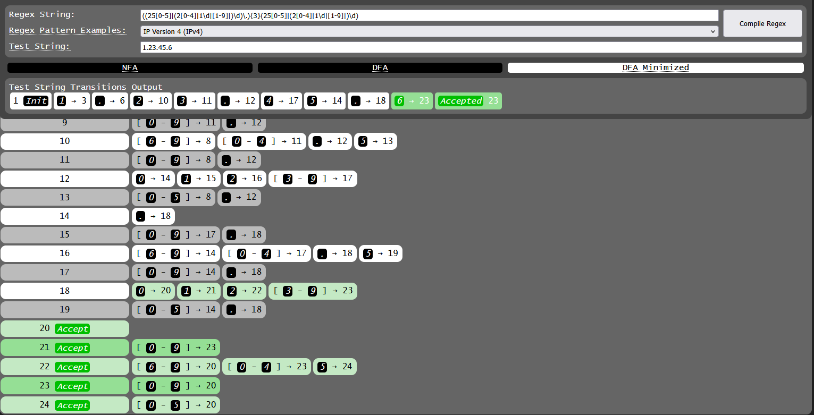

# RegexStateMachine (regex-to-dfa)
Web application that converts a Regular Expression (Regex) to finite state machines (FSM) such as a Nondetermistic Finite Automata (NFA) and a Deterministic Finite Automata (DFA). The web application visualizes the FSM into a transition table and shows test strings moving into transitions of states to either accept or reject it.

## GitHub Page
The web application is deployed at https://cornsnek.github.io/regex-to-dfa/

## About
Originally, this project was intended to make a Regex engine because I wanted to learn how to compile BNF language rules into Regex, but I was more interested in in the mathematics and calculations of NFA and DFA finite state machines. The following web applications were an inspiration that led to create this application:
- https://regex101.com
- https://regexr.com
- https://cyberzhg.github.io/toolbox/nfa2dfa
- https://joeylemon.github.io/nfa-to-dfa/
- https://github.com/SnootierMoon/re-fsm-tool/tree/main

## Zig Build
In order to build the website and wasm binary: `zig build wasm -Doptimize=...`

For copying just the website files but not build the wasm binary: `zig build copy_website`

Python 3 is also used to build the server to build and test the website: `zig build server`

## Regex Limitations/Quirks
- When using the set range character `-` in a set, it needs to be escaped (`\-`) if using it in a set.
- Alternations `|` outside parenthesis match only single characters/expressions and have higher precedence than concatenation. For example, `0A|(bc)|[d-g]|\d9` accepts strings either of form `0A9`, `0(bc)9`, `0[d-g]9`, or `0\d9`. However, `(0A|(bc)|[d-g]|\d9)` would accept strings either of form `0A`, `bc`, `d`/`e`/`f`/`g`, or `[0-9]9`
- The numbered quantifiers of the form `{A,B}` can also have `A` or `B` be optional to allow lesser than or greater than quantifiers (e.g. `{,B}` and `{A,}`).
- An escape character `\U` supports unicode for values from hexadecimal values of `010000` up to `10ffff`. E.g. `\U01D11E` as `𝄞`.
- Empty sets are disallowed (`[]` and `[^\u0000-\U10ffff]` for example) as the DFA minimization would convert all states into the Error State 0 (or Sink State), thus rejecting all strings from being accepted.
- The web application will only just match test strings from beginning to end. Therefore, this app doesn't implement anchors `^` and `$`, lookaheads, lookbehinds, word boundaries, non-capture groups, greedy/lazy/possessive quantifiers, backreferences.
- Unicode strings are supported to test in Regex String and Test String.